# Major-Project AI Pentester - Architecture Diagrams

This document contains Mermaid diagrams illustrating the architecture of the Major-Project AI Pentester agent.

## High-Level Architecture

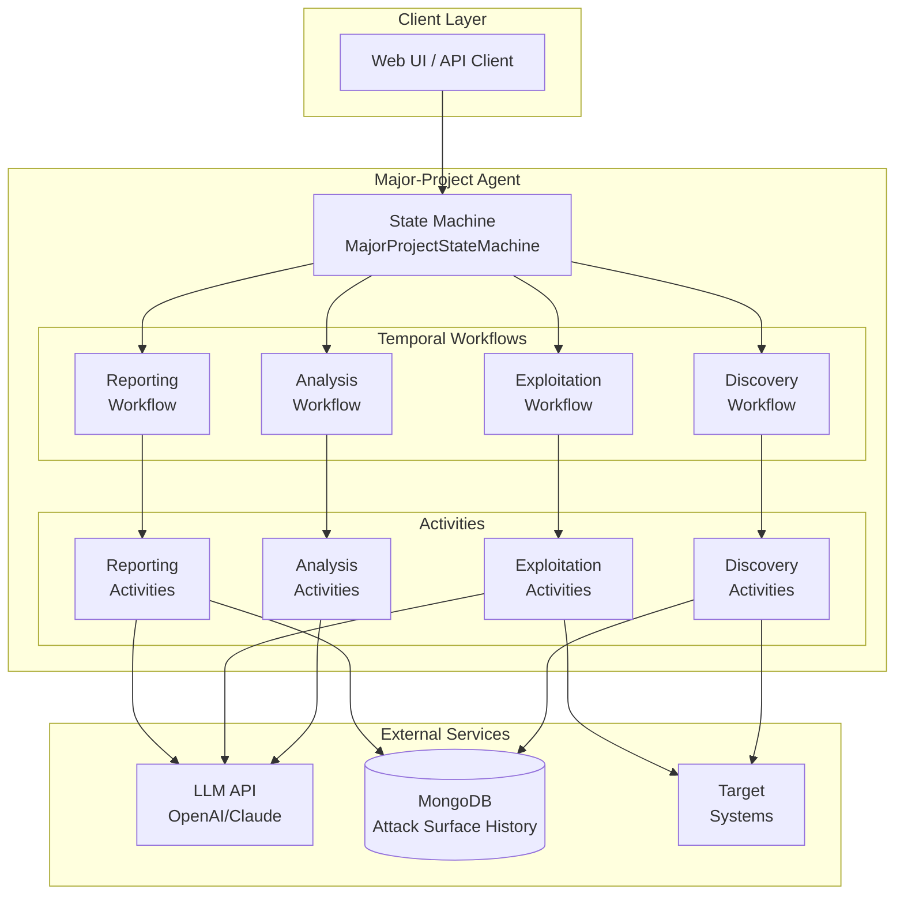

## State Machine Flow

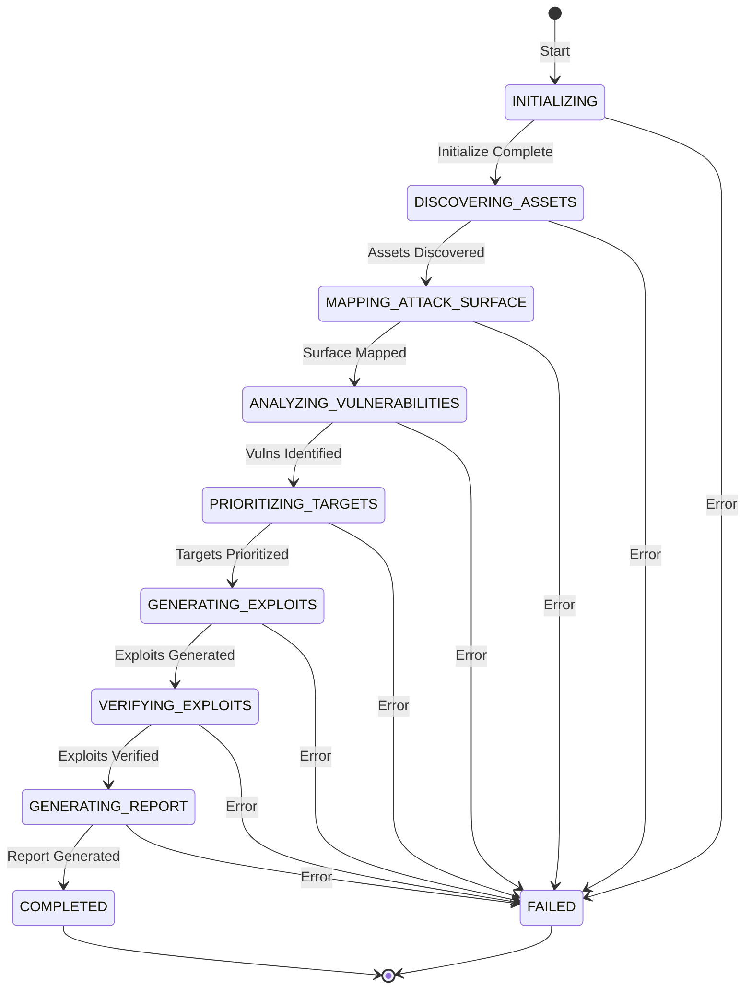

## Discovery Workflow

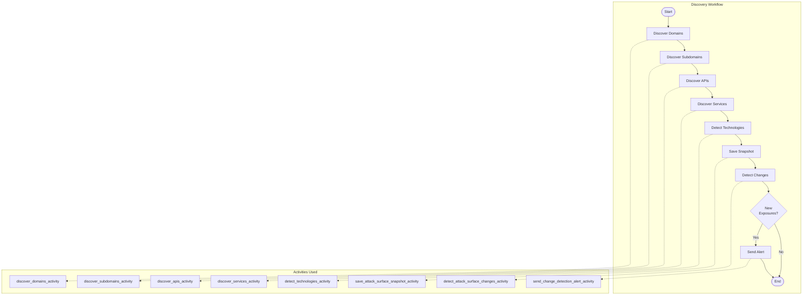

## Analysis Workflow

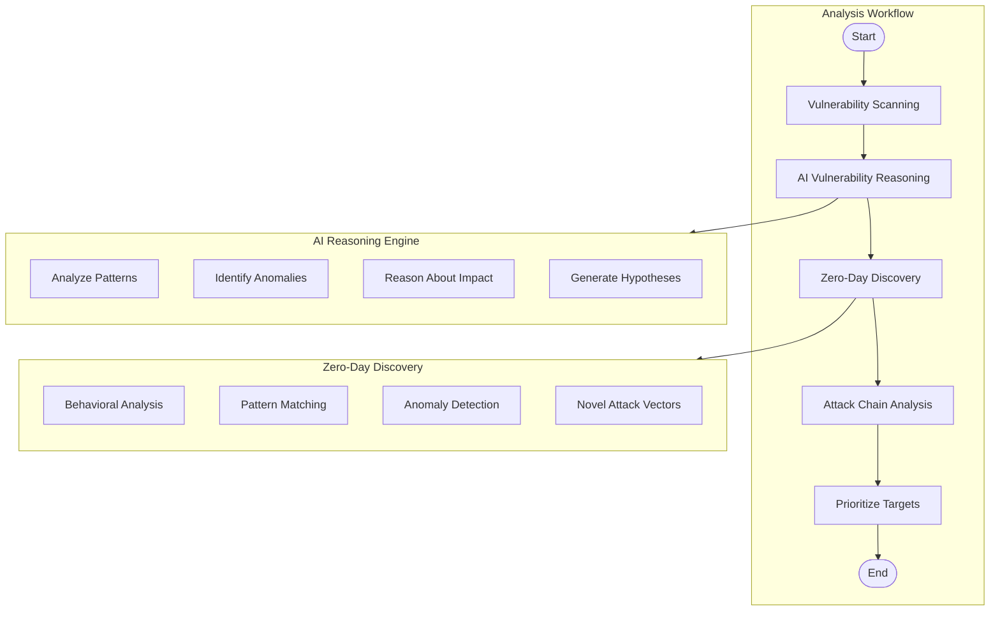

## Exploitation Workflow

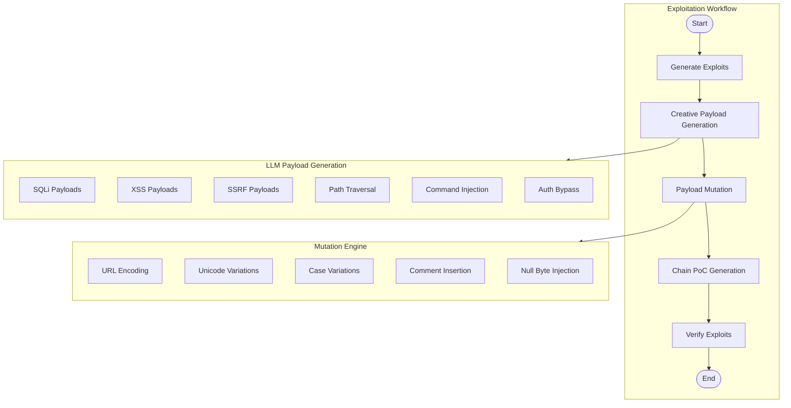

## Reporting Workflow

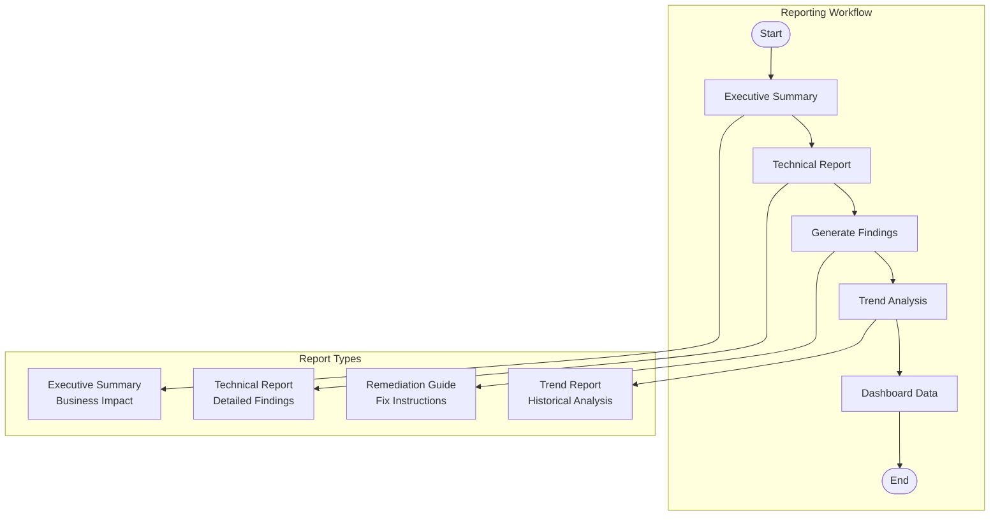

## Agentic Pentest Loop

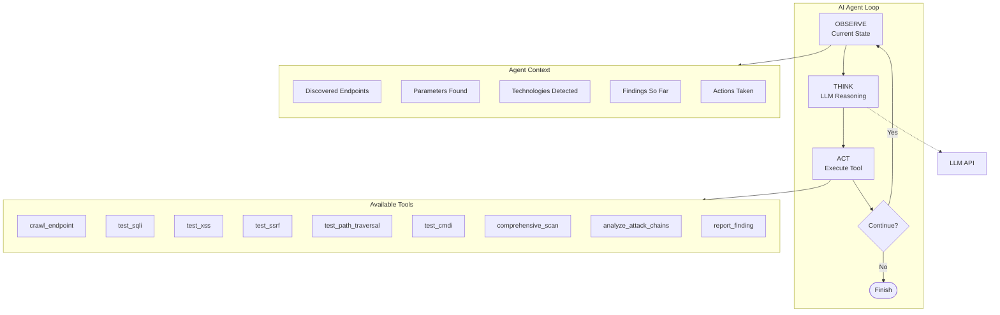

## Data Flow

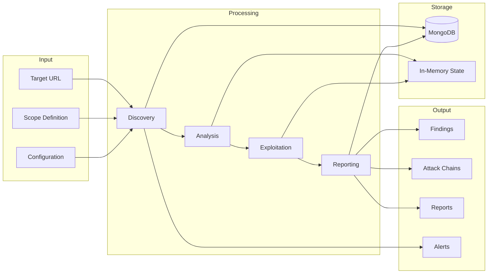

## Component Dependencies

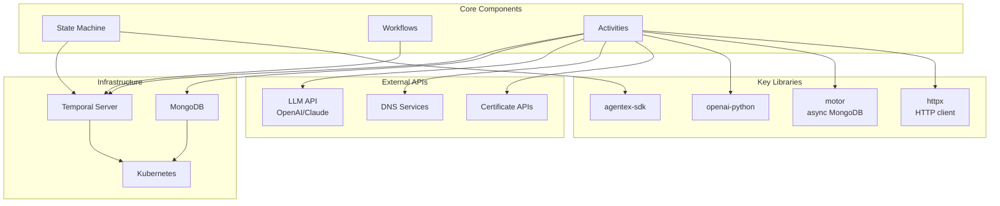

## Vulnerability Testing Flow

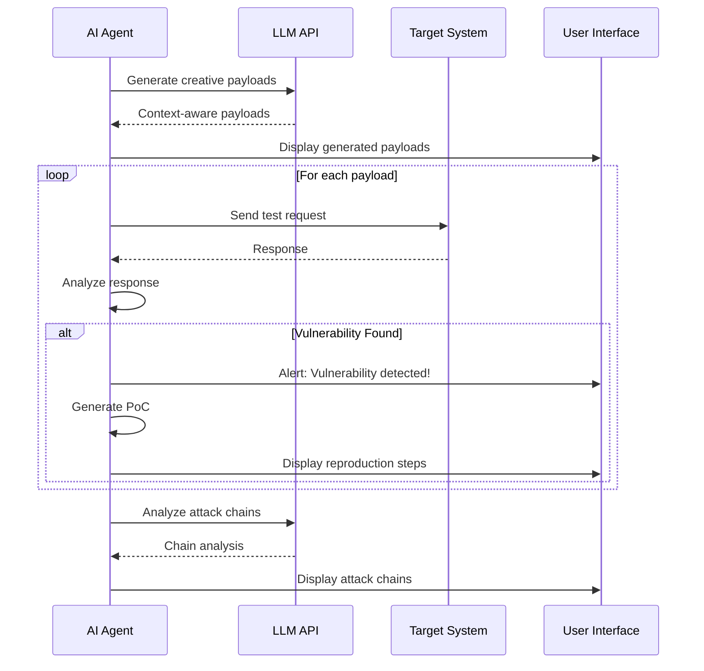

## Deployment Architecture

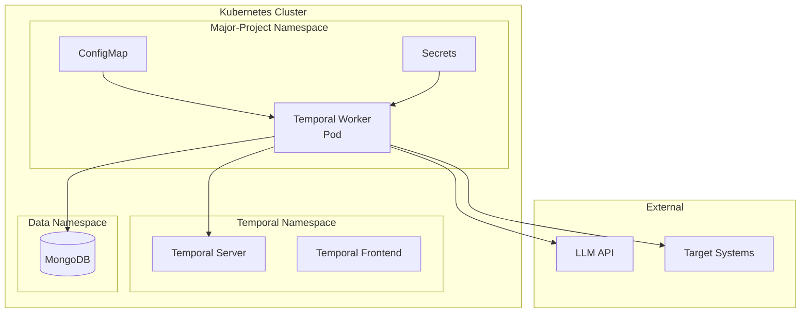

## Security Considerations

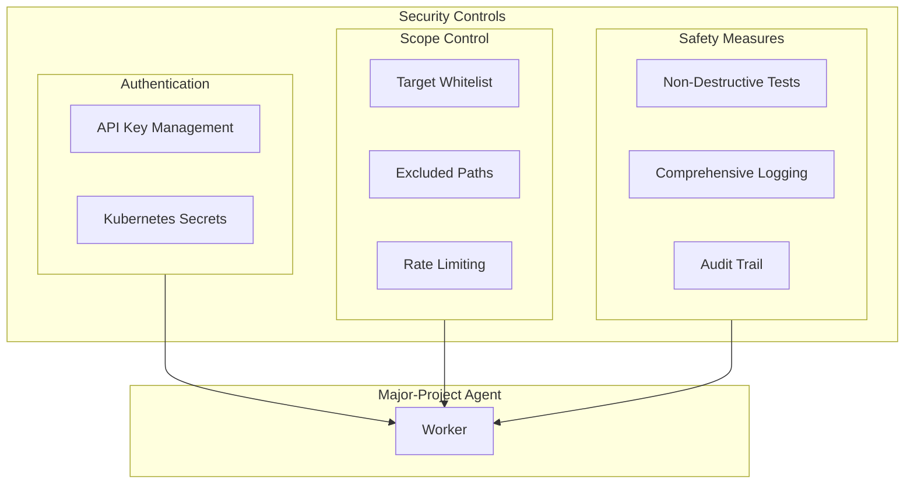

---

## Legend

| Symbol | Meaning |
|--------|---------|
| Rectangle | Process/Component |
| Diamond | Decision |
| Cylinder | Database |
| Rounded Rectangle | Start/End |
| Dashed Line | Reference/Dependency |
| Solid Line | Data Flow |

## Notes

1. **State Machine**: Controls the overall workflow progression
2. **Workflows**: Temporal workflows that orchestrate activities
3. **Activities**: Individual units of work (discovery, testing, reporting)
4. **LLM Integration**: AI-powered payload generation and analysis
5. **Storage**: MongoDB for persistence, in-memory for runtime state